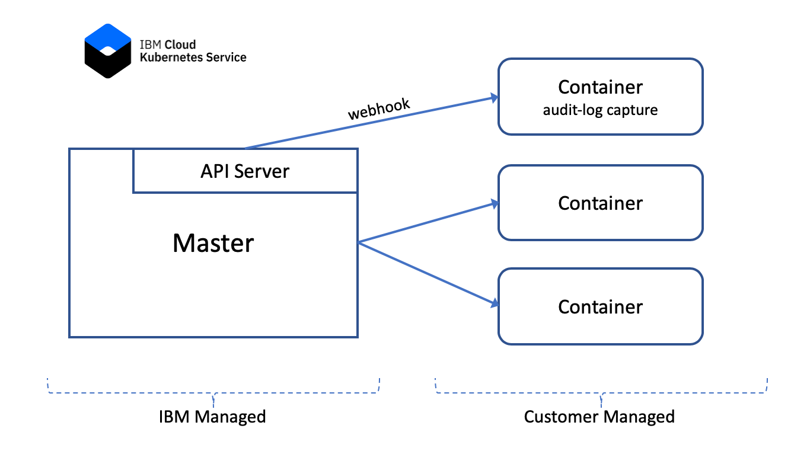

# Capture IBM Cloud Kubernetes Service (IKS) audit logs

Kubernetes Auditing is part of the [kube-apiserver](https://kubernetes.io/docs/reference/generated/kube-apiserver/), and will log all requests that the API Server processes for audit purposes. When using [IBM Cloud Kubernetes Service (IKS)](https://www.ibm.com/cloud/container-service) the API Server and Master node are managed for the user. The API Server provides a webhook which can be used to send all audit events to a remote backend.

We'll setup our own container along side our other pods to serve as a target for the webhook and capture the audit logs. Since the webhook doesn't provide any authentication, we want to ensure we don't expose the container http endpoint beyond our private network. 



The problem can be broken into three steps
1) The simple HTTP server that processes the data
2) The deployment of the container 
3) Configuration of the webhook

## Step 1 - simple HTTP server

The audit log webhook pay load comes in the following format

```
{
  "kind": "EventList",
  "apiVersion": "audit.k8s.io/v1",
  "metadata": {},
  "items": [ ... ]
}
```

There are 1 or more items, each a JSON audit record. We will create a simple node.js web server which can parse the payload and emit each item as a unique line into the logging system. Since we are creating a container, we can make use of the cloud native approach of simply dumping our logs onto stdout.

To handle the incoming webhook, a simple node.js application [app.js](app.js) was created.

The application runs on port 3000, making it easy to test locally. There is obviously much more we could do to enhance this simple application, but this will work as a starting point.

Next we will create a [Dockerfile](Dockerfile) that describes the container we want, and push it into an IBM Cloud hosted registry.

We can do the build via a Makefile. The build target assumes that you are logged into the IBM Cloud and the registry, and that you have a container registry namespace. The name of your namespace should be in an environment variable `NAMESPACE` so the Makefile can pick it up. *Note* See the `setup` target int he Makefile for details.


```
$ make build
```

## Step 2 - deployment

The deployment is quite straight forward. We want to create pod based on the image we pushed to the registry. The container runs on port 3000 by default, but we'll map this to 80 to make plain old http work. We also need to make use of a kubenetes service to provide an IP address for us to target. While we will have an internal name for the service, the IKS master can't see the names but it an see the IPs.

This is all captured in the [YAML file](kube-audit.yaml.tmpl), the Makefile uses [envsubst](https://linux.die.net/man/1/envsubst) to configure the YAML file with your `NAMESPACE` environment variable.

```
$ make deploy
```

## Step 3 - Configure webhook

In the previous step (deployment) will have dumped the services in your IKS cluster. One of these is the newly created **kube-audit** service.

```
NAME         TYPE        CLUSTER-IP      EXTERNAL-IP   PORT(S)          AGE
kube-audit   ClusterIP   172.21.255.26   <none>        80/TCP           1m
```

We need to combine this IP address with the name of the cluster and issue two commands:

```
$ ibmcloud ks apiserver-config-set audit-webhook <cluster_name_or_ID> --remoteServer http://172.21.255.26
$ ibmcloud ks apiserver-refresh --cluster <cluster_name_or_ID>
```

The first one sets the webhook, and the second initiates a refresh which will enable the newly set webhook. Refreshing the API Server can take a few minutes, now is probably a great time to go for a coffee.


[MIT License](https://github.com/andrewlow/Kube-Audit-Webhook/blob/master/LICENSE)
